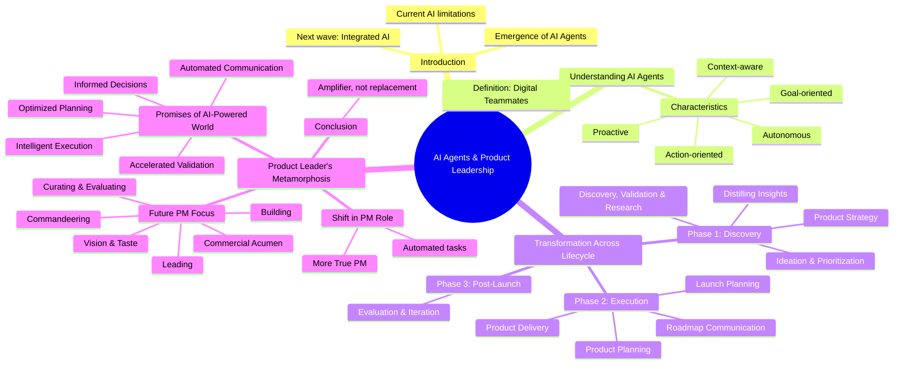

# Beyond the Prompt: How AI Agents Are Redefining Product Leadership

The digital landscape of product development is shifting beneath our feet. While generative AI has already found its way into many product teams, primarily through conversational interfaces, these early tools often feel like islands. They operate with limited access to the vast ocean of business data and remain separate from the very systems that define our daily product reality. This fragmented experience hints at a deeper truth: we're merely at the foothills of AI's true potential in product management.

The horizon reveals a new dawn: AI deeply woven into the fabric of our "single source of truth" systems. This isn't just about asking questions and getting answers; it's about an intelligence imbued with the intimate knowledge of your strategic compass, every nascent idea, the pulse of your team's capacity, and the authentic voice of your customers. The magic? It unfolds without the need for a meticulously crafted prompt. This profound evolution is being powered by a new class of digital entities: AI agents. Though still nascent in commercial offerings, their disruptive power demands our immediate attention.

 

key facts

 

## The Agent's Blueprint: More Than Just a Tool

Forget the notion of AI as a passive assistant awaiting your command. Envision agents as an infinitely scalable extension of your team, digital colleagues with distinct capabilities that transcend traditional software:

These aren't mere executors of instructions. Agents possess an inherent proactivity, anticipating needs, continuously scanning the environment for critical shifts, and surfacing best practices before you even think to ask. Their autonomy allows them to orchestrate complex tasks over days or weeks, coordinating seamlessly with other agents and services to advance larger objectives. What truly sets them apart is their goal-orientation: they can decompose a high-level aim into actionable steps, identify when things go awry, attempt self-correction, or intelligently escalate to a human when intervention is truly required. Furthermore, their context-awareness is unparalleled, drawing from vast data reservoirs, maintaining a persistent memory of interactions, and subtly adapting to your unique preferences and work style over time. Crucially, agents are built to take action, managing workflows across diverse systems, leveraging various tools for data analysis or visualization, and communicating proactively through channels like email or notifications.

## A New Operating System for Product: Transformation Across the Lifecycle

How will this paradigm shift, from isolated generative tools to integrated AI agents, fundamentally alter the rhythm of product development?

### Unlocking the Data Deluge & Strategic Clarity

Product teams often find themselves awash in a sea of inputs – feature requests, customer feedback, competitive intelligence, internal strategy documents. Yet, how much of this rich data truly informs critical decisions? Agents will become the ultimate navigators of this information ocean. They will continuously distill insights from customer interactions, market shifts, and internal data streams, surfacing new trends and synthesizing intelligence that was previously impossible to gather. While core product strategy remains the domain of human leaders, agents will serve as indispensable thought partners, integrating immense contextual data to help formulate diverse strategic scenarios, rigorously stress-test assumptions, and reveal potential blind spots, freeing leaders to focus on the ultimate strategic choices. This deep knowledge will also fuel ideation, moving beyond generic brainstorming to suggest highly relevant opportunities and solutions, acting as a "product coach" to develop ideas, identify risks, and even coordinate initial prototyping. The often resource-intensive validation phase will be scaled dramatically, with agents assisting in user research coordination, recruitment, and even engaging users in real-time follow-up conversations to capture rich contextual feedback.

### Orchestrating Execution & Seamless Communication

The execution phase, where plans materialize, demands meticulous orchestration. Agents will revolutionize product planning by leveraging deep contextual understanding within product management platforms. They will tackle complexities like effort estimates, cross-team dependencies, and capacity planning, presenting planning scenarios and generating updated plans in minutes, not weeks. Roadmap communication, a frequent pain point, will be transformed. Imagine stakeholders querying an AI agent directly via the roadmap interface, receiving immediate, contextual answers, effectively creating a "digital twin" for product leaders. Personalized notifications will keep everyone informed of relevant updates. In the delivery phase, agents will increasingly facilitate the work itself, monitoring progress, flagging risks and blockers, and even coordinating teams to overcome them, granting product managers more lead time for strategic intervention. Launch planning, too, will evolve from a drafting exercise to a strategic partnership, with AI assisting in defining plans, internal enablement, marketing messages, and even generating product graphics.

### Continuous Evolution & Outcome Orientation

Post-launch evaluation, often a casualty of the next initiative's urgency, will become automated and deeply integrated. Agents will distill insights from feedback, track progress against objectives, assess release outcomes, and even initiate automated A/B tests. As product delivery accelerates, a new challenge emerges: customer tolerance for constant change. Here, agentic AI will be crucial for personalized onboarding to new functionality, ensuring the right users receive the right updates at the right time, tailored to their specific needs.

## The Product Leader's Metamorphosis: Beyond the Mundane

The most profound impact of AI agents will be the liberation of product managers to engage in more true product management. The deluge of miscellaneous tasks, low-level information processing, and much of the project management around delivery will be automated. What remains, and becomes exponentially more critical, are the core responsibilities of genuine product strategy and deep product discovery.

The AI-powered world we are entering promises:

**Enlightened Decisions:** Unprecedented access to market and customer insights, delivered precisely when and how needed.

**Rapid Validation:** De-risking product bets faster and more effectively through facilitated customer interactions, simulations, and prototype generation.

**Streamlined Planning:** Complex planning cycles condensed from weeks to mere minutes.

**Effortless Communication:** Agents managing much of the information flow, freeing PMs from constant intermediation.

**Intelligent Execution:** Automated monitoring, coordination, and proactive problem-solving for delivery.

So, what will the product managers of tomorrow truly do? With AI handling the operational heavy lifting, their focus will ascend to higher-order functions:

**Commandeering:** Directing AI, delegating tasks, providing essential context, and overseeing the generated output.

**Curating & Evaluating:** Acting as a "manager-of-managers," reviewing, refining, and ultimately being accountable for AI-generated insights, plans, and recommendations. Human judgment remains the ultimate arbiter.

**Building:** Freed from the mundane, "full-stack" PMs may deepen their functional expertise, even conceptualizing and delivering solutions with greater independence.

**Leading:** With expanded bandwidth, PMs can dedicate more energy to crafting vision, fostering alignment, and inspiring their teams. While AI can inform a roadmap, it's the human leader who builds trust and delivers it with compelling conviction.

**Vision & Taste:** LLMs excel at remixing existing information. PMs will leverage their intuition, innate product sense, and profound understanding of human emotion to drive truly innovative leaps and create products that customers adore, even if they couldn't articulate the need themselves.

**Commercial Acumen:** Liberated from tactical minutiae, PMs will have more capacity to consider the overarching strategic and commercial impact of every product decision.

---

*AI agents are not a substitute for product managers. They are a formidable amplifier, elevating the role to its most strategic and impactful form.*
